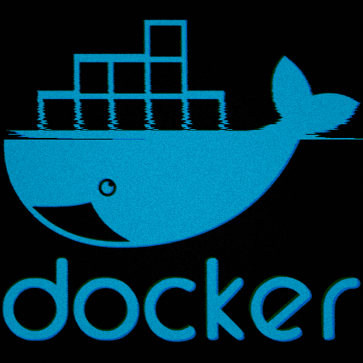
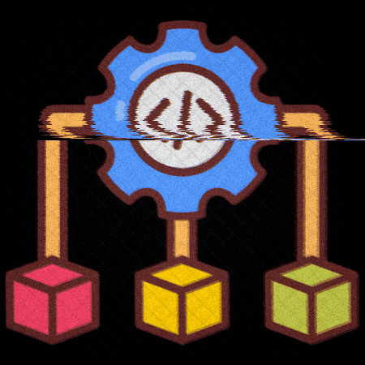
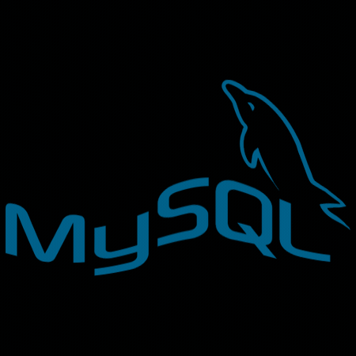

# Hi 👋, I'm Aadesh

### Developer | Learner

MCA graduate specializing in Artificial Intelligence & Machine Learning, passionate about building scalable Java backend solutions and intelligent applications. 

---

## 🛠 Tech Stack

 

---

## ✨ Curious About What I Build?

  

## 🤝 Connect With Me

<a href="https://www.linkedin.com/in/aadesh-kudale/">LinkedIn</a>
&nbsp; • &nbsp;
<a href="mailto:aadeshkudale7@gmail.com">Email</a>

